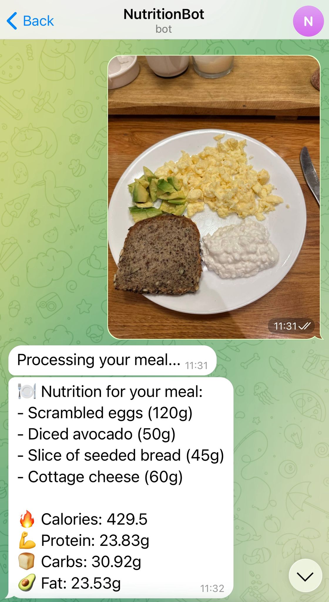
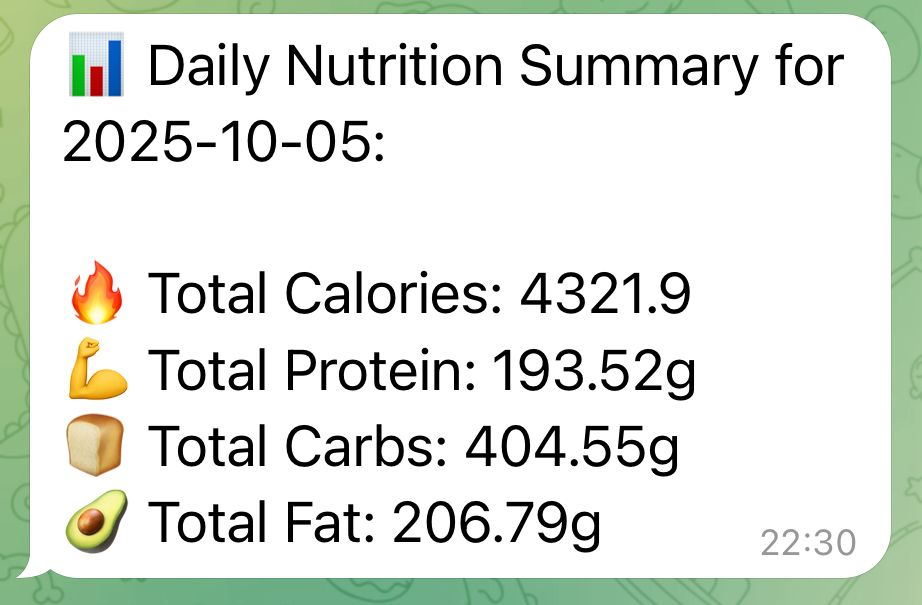

# AI-Powered Nutrition Tracker via Telegram

This project is a serverless, AI-powered nutrition tracker that allows users to log their meals simply by sending a picture to a Telegram bot. The system analyzes the image, calculates nutritional information, and logs the data to a personal Google Sheet.

  

## ✨ Features

| Feature                       | Description                                                                                                                                                           | 
| ----------------------------- | --------------------------------------------------------------------------------------------------------------------------------------------------------------------- |
| **Image-Based Meal Logging**  | Send a picture of your meal to the Telegram bot to begin the logging process.                                                                                         |
| **AI Food Identification**    | Utilizes Google Gemini to identify food items and estimate their weights directly from the image.                                                                     |
| **Enhanced Nutrition Data**   | Queries the USDA's FoodData Central API and refines the results with Gemini to find the most accurate nutritional match.                                                 |
| **Idempotent Processing**     | Ensures each meal is processed exactly once, preventing duplicate entries.                                                                                            |
| **Automated Logging**         | Automatically appends each meal's nutritional information to a specified Google Sheet.                                                                                |
| **Daily Summary Reports**     | A scheduled function runs daily to calculate the total nutrition for the day and sends a report to the user via Telegram.                                               |
| **Serverless Architecture**   | Built on a serverless AWS stack (Lambda, SQS, API Gateway, DynamoDB) for high reliability and scalability.                                                            |
| **Error Handling**            | Employs an SQS Dead-Letter Queue (DLQ) to capture and isolate failed messages for debugging, with a CloudWatch Alarm for immediate notification of processing failures. |

## Usage

1.  Open a chat with your configured Telegram bot.
2.  Send a picture of your meal.
3.  Receive a confirmation that your meal is being processed.
4.  A few moments later, receive a message with the nutritional breakdown for the meal.
5.  At the end of each day, receive a daily summary report.
6.  All meals and daily summaries are logged in your personal Google Sheet for historical tracking.

  
  

## 🚀 Getting Started

### Prerequisites

Before you begin, ensure you have the following:

- An AWS Account
- A Telegram Bot Token
- A Google Cloud Project with the Google Sheets and Gemini APIs enabled
- A FoodData Central API Key
- Your personal Telegram Chat ID

### Deployment

This project is deployed using Terraform. For detailed, step-by-step instructions, please refer to the **[Deployment Guide](./docs/DEPLOYMENT.md)**.

## 🛠️ Tech Stack

## 💰 Cost

This project is designed to be completely free to operate for typical personal use, leveraging the generous free tiers offered by AWS and the free usage policies of integrated third-party services. Below is a breakdown of the main components and their cost implications:

*   **AWS Lambda:** 1M free requests per month and 400,000 GB-seconds of compute time per month.
*   **AWS API Gateway (HTTP API):** 1M free requests per month.
*   **Amazon SQS (Simple Queue Service):** 1M free requests per month.
*   **Amazon DynamoDB:** free 25 GB of storage.
*   **AWS Systems Manager (SSM) Parameter Store:** standard parameters are free.
*   **Amazon CloudWatch Events (EventBridge):** 14M free events per month.
*   **Google Gemini API:**
    *   **Gemini 2.5 Pro:** free 5 RPM, 125,000 TPM, 100 RPD.
    *   **Gemini 2.5 Flash:** free 10 RPM, 250,000 TPM, 250 RPD. 
*   **FoodData Central (FDC) API:** completely free.
*   **Google Sheets API:** free to use.
*   **Telegram Bot API:** completely free.

