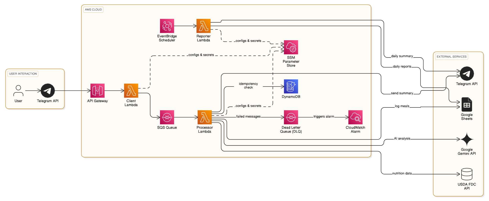

# AI-Powered Nutrition Tracker via Telegram

This project is a serverless, AI-powered nutrition tracker that allows users to log their meals simply by sending a picture to a Telegram bot. The system analyzes the image, calculates nutritional information, and logs the data to a personal Google Sheet.

## Features

- **Image-Based Meal Logging**: Send a picture of your meal to the Telegram bot to begin the logging process.
- **AI Food Identification**: Utilizes Google Gemini to identify food items and estimate their weights directly from the image.
- **Enhanced Nutrition Data Search**: Queries the USDA's FoodData Central API across multiple data types (SR Legacy, Foundation, Survey (FNDDS)). The results are then refined by Gemini to find the most accurate nutritional match.
- **Idempotent Processing**: Ensures each meal is processed exactly once, preventing duplicate entries in your data, even if messages are redelivered.
- **Automated Google Sheets Logging**: Automatically appends each meal's nutritional information to a specified Google Sheet.
- **Daily Summary Reports**: A scheduled function runs daily to calculate the total nutrition for the day, log it to a separate summary sheet, and send a report to the user via Telegram.
- **Robust & Scalable Architecture**: Built on a serverless AWS stack (Lambda, SQS, API Gateway, DynamoDB) for high reliability and scalability.
- **Error Handling and Monitoring**: Employs an SQS Dead-Letter Queue (DLQ) to capture and isolate failed messages for debugging, with a CloudWatch Alarm for immediate notification of processing failures.

## Architecture

The application consists of three core, decoupled services orchestrated by AWS:

1.  **Client Lambda (`client_lambda.py`)**:
    -   Triggered by an **API Gateway** webhook that receives messages from Telegram.
    -   When a user sends an image, this function dispatches a job message to an **SQS queue**.
    -   Provides an immediate "Processing..." acknowledgment to the user.

2.  **Processor Lambda (`processor_lambda.py`)**:
    -   Triggered by new messages in the **SQS queue**.
    -   **Idempotency Check**: Uses a DynamoDB table to ensure each message is processed only once.
    -   Downloads the image from Telegram.
    -   Uses the Gemini Vision API to identify food items and estimate their weights.
    -   For each food item, it queries the FoodData Central API. Gemini is then used again to analyze the search results and select the best nutritional match.
    -   Calculates the total nutrition for the meal.
    -   Writes the meal data to the primary Google Sheet.
    -   Sends a final summary message to the user on Telegram.

3.  **Reporter Lambda (`reporter_lambda.py`)**:
    -   Triggered by a daily **Amazon EventBridge** schedule (cron job).
    -   Reads all meal entries for the current day from the Google Sheet.
    -   Calculates the total nutritional values for the day.
    -   Appends the daily summary to a separate "Daily Reports" sheet.
    -   Sends the daily summary report to the user on Telegram.

## Error Handling and Monitoring

-   **SQS Dead-Letter Queue (DLQ)**: If the `processor_lambda` repeatedly fails to process a message, SQS automatically moves the message to a DLQ. This prevents endless retries and isolates problematic messages for manual inspection and debugging.
-   **CloudWatch Alarm**: A CloudWatch alarm monitors the DLQ. If a message arrives in the DLQ, the alarm triggers a notification, ensuring immediate awareness of any processing failures.

## Setup and Deployment

A complete, step-by-step guide for deploying the application is available in [**deployment_guide.md**](./deployment_guide.md).

The high-level steps are:
1.  **Prerequisites**: Ensure you have an AWS account, a Telegram bot, and a Google Cloud project with the necessary APIs enabled.
2.  **Store Secrets**: Securely store all API keys and tokens in AWS Systems Manager (SSM) Parameter Store.
3.  **Create AWS Resources**: Set up an SQS queue with a corresponding Dead-Letter Queue (DLQ), a DynamoDB table for idempotency, and an IAM role with the appropriate permissions.
4.  **Create a Lambda Layer**: Create a single Lambda Layer to manage all Python dependencies for the functions.
5.  **Deploy Functions**: Deploy the three Lambda functions (`client`, `processor`, `reporter`) and configure their triggers and environment variables.
6.  **Configure API Gateway**: Set up an HTTP API endpoint to act as the Telegram webhook.
7.  **Set Webhook**: Point your Telegram bot to the new API Gateway endpoint.

## Usage

1.  Open a chat with your configured Telegram bot.
2.  Send a picture of your meal.
3.  Receive a confirmation that your meal is being processed.
4.  A few moments later, receive a message with the nutritional breakdown for the meal.
5.  At the end of each day, receive a daily summary report.
