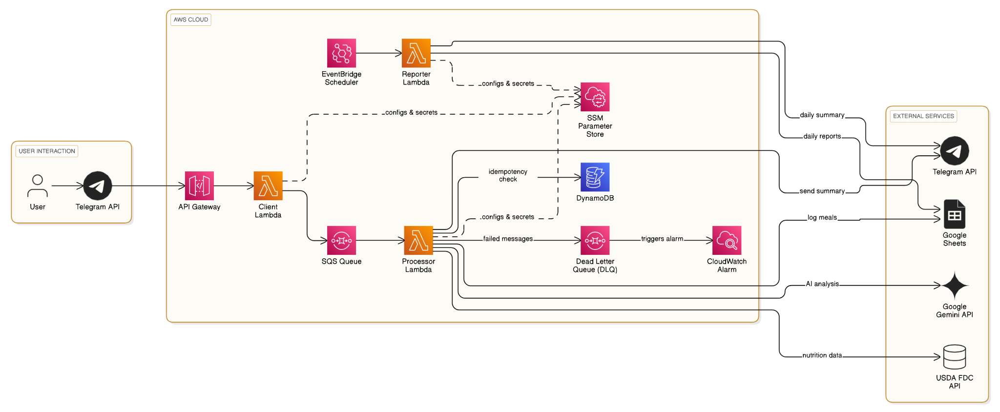

# Architecture Overview: Nutrition Tracker

## 1. High-Level Overview

The Nutrition Tracker is a serverless application designed to help users log their meals and receive daily reports via Telegram. It leverages AWS Lambda for compute, Amazon SQS for message queuing, Amazon DynamoDB for idempotency, and AWS API Gateway for external integration. It interacts with external services like Telegram, Google Gemini API, FoodData Central (FDC) API, and Google Sheets.

## 2. Core Components

### 2.1 AWS Services

*   **AWS API Gateway (HTTP API):** Serves as the entry point for Telegram webhook requests, forwarding them to the `client_lambda`.
*   **AWS Lambda:** The compute service hosting the three main functions: `client_lambda`, `processor_lambda`, and `reporter_lambda`.
*   **Amazon SQS (Simple Queue Service):** Acts as a buffer between the `client_lambda` and `processor_lambda`, ensuring reliable message delivery and decoupling. Includes a Dead-Letter Queue (DLQ) for failed messages.
*   **Amazon DynamoDB:** Used by the `processor_lambda` to store idempotency keys, preventing duplicate processing of Telegram messages.
*   **AWS Systems Manager (SSM) Parameter Store:** Securely stores sensitive configuration parameters and API keys (e.g., Telegram bot token, Gemini API key, Google Sheets credentials).
*   **Amazon CloudWatch Events (EventBridge):** Schedules the `reporter_lambda` to run daily for generating reports.

### 2.2 Lambda Functions

*   **`client_lambda`:**
    *   **Trigger:** AWS API Gateway (Telegram Webhook - `POST /webhook`).
    *   **Function:** Receives incoming Telegram messages, extracts relevant information, and sends them to the SQS queue for asynchronous processing.
    *   **Dependencies:** Telegram Bot Token (from SSM), SQS Queue URL.
*   **`processor_lambda`:**
    *   **Trigger:** Amazon SQS (receives messages from the queue).
    *   **Function:** Processes the Telegram messages. This involves:
        *   Checking DynamoDB for idempotency to avoid reprocessing.
        *   Interacting with the Google Gemini API for natural language understanding or food recognition.
        *   Querying the FoodData Central (FDC) API for nutritional information.
        *   Logging meal data to Google Sheets.
    *   **Dependencies:** Telegram Bot Token (from SSM), Gemini API Key (from SSM), FDC API Key (from SSM), Google Sheets Credentials (from SSM), Spreadsheet ID (from SSM), DynamoDB Table Name.
*   **`reporter_lambda`:**
    *   **Trigger:** Amazon CloudWatch Events (scheduled daily).
    *   **Function:** Generates daily nutrition reports by reading data from Google Sheets and sends the summary to the user via Telegram.
    *   **Dependencies:** Telegram Bot Token (from SSM), Google Sheets Credentials (from SSM), Spreadsheet ID (from SSM), Telegram Chat ID (from SSM).

### 2.3 Shared Components

*   **Lambda Layer (`dependencies_layer`):** Contains common Python libraries (from `requirements.txt`) and shared utility code (`common/utils.py`) used by all Lambda functions, promoting code reuse and reducing deployment package sizes.

## 3. Data Flow

1.  **User Interaction:** A user sends a message to the Telegram bot.
2.  **Telegram Webhook:** Telegram forwards the message to the AWS API Gateway endpoint (`POST /webhook`).
3.  **API Gateway to `client_lambda`:** API Gateway invokes the `client_lambda` function.
4.  **`client_lambda` to SQS:** The `client_lambda` extracts the message and sends it to the SQS queue.
5.  **SQS to `processor_lambda`:** The `processor_lambda` is triggered by messages arriving in the SQS queue.
6.  **`processor_lambda` Processing:**
    *   Checks DynamoDB for idempotency.
    *   Calls Gemini API for analysis.
    *   Calls FDC API for food data.
    *   Writes processed meal data to Google Sheets.
7.  **Scheduled Reporting:** Daily, CloudWatch Events triggers the `reporter_lambda`.
8.  **`reporter_lambda` Reporting:** The `reporter_lambda` reads data from Google Sheets, compiles a report, and sends it back to the user via Telegram.

## 4. Key Integrations

*   **Telegram Bot API:** For user interaction (receiving messages, sending reports).
*   **Google Gemini API:** For AI-powered natural language understanding and food item identification.
*   **FoodData Central (FDC) API:** For retrieving detailed nutritional information about food items.
*   **Google Sheets API:** For storing and retrieving meal logs and daily report data.

## 5. Architecture Diagram

