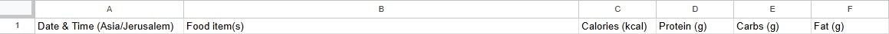

# Deployment Guide: Nutrition Tracker

This guide provides step-by-step instructions to deploy the nutrition tracker application on AWS using a robust Lambda Layer approach.

## 1. Prerequisites

- An AWS account.
- A Telegram Bot token from BotFather.
- A Google Cloud project with the Google Sheets API and Gemini API enabled.
- A service account for Google Cloud with credentials to access the Sheets API.
- A FoodData Central API key.

## 2. Create Google Sheet

The application uses a Google Sheet to store meal entries and daily summaries.

1.  **Create a New Google Sheet**:
    *   Go to [Google Sheets](https://sheets.new) and create a new blank spreadsheet.
    *   Rename the spreadsheet to something descriptive (e.g., "Nutrition Tracker Data").
2.  **Configure Sheets**:
    *   Ensure the first sheet is named `Meals`. This is where individual meal entries will be logged. 
    
    * set the columns names as:
    
    *   Create a second sheet and name it `Daily_Reports`. This is where daily summaries will be appended.

    * set the columns names as:
    
3.  **Share with Service Account**:
    *   Locate the email address of your Google Service Account (this is typically found in the JSON credentials file you downloaded, under the `client_email` field).
    *   Click the "Share" button in your Google Sheet.
    *   Add the service account email address and grant it **Editor** permissions.
4.  **Note Spreadsheet ID**:
    *   The Spreadsheet ID is part of the URL of your Google Sheet (e.g., `https://docs.google.com/spreadsheets/d/YOUR_SPREADSHEET_ID/edit`).
    *   You will need this ID to store in AWS SSM Parameter Store.

## 3. Securely Store Secrets in SSM

Before deploying, store all secrets in AWS Systems Manager (SSM) Parameter Store.

1.  **Navigate to SSM Parameter Store** in the AWS Console.
2.  Click **Create parameter** for each of the following secrets. Use the type `SecureString`.
    -   **/nutrition-tracker/telegram-bot-token**: Your Telegram bot token.
    -   **/nutrition-tracker/gemini-api-key**: Your Google Gemini API key.
    -   **/nutrition-tracker/fdc-api-key**: Your FoodData Central API key.
    -   **/nutrition-tracker/google-sheets-credentials**: The full JSON content of your Google service account credentials file.
    -   **/nutrition-tracker/spreadsheet-id**: The ID of your Google Sheet.
    -   **/nutrition-tracker/telegram-chat-id**: Your personal Telegram Chat ID (get this by messaging `@userinfobot` on Telegram).

## 4. Create the SQS Queue

This queue decouples the client and processor functions.

### 4.1. Create Dead-Letter Queue (DLQ)

This queue will hold messages that fail to be processed after a certain number of retries, preventing them from endlessly retrying and allowing for inspection.

1.  **Navigate to SQS** in the AWS Console.
2.  Click **Create queue**.
3.  **Name**: `nutrition-tracker-dlq` (Standard queue type).
4.  Leave default settings and click **Create queue**.
5.  Note the **ARN** of this DLQ; you will need it in the next step.
6.  **(Recommended)** Create a CloudWatch alarm to monitor the number of messages in the DLQ. This will notify you if messages are failing to be processed.

### 4.2. Create Main SQS Queue

1.  **Navigate to SQS** in the AWS Console.
2.  Click **Create queue**.
3.  **Name**: `nutrition-tracker-queue` (Standard queue type).
4.  Set the **Default visibility timeout** to **5 minutes 30 seconds**.
5.  **Redrive policy**:
    *   Enable Redrive policy.
    *   **Dead-letter queue**: Select the `nutrition-tracker-dlq` you just created.
    *   **Maximum receives**: Set to `5` (This means a message will be retried 5 times before being sent to the DLQ).
6.  Leave the other default settings and click **Create queue**.
7.  Note the **Queue URL** and **ARN** for later.

## 5. Create DynamoDB Table for Idempotency

To ensure that each meal is processed exactly once, we will use a DynamoDB table to store the `idempotency_key` of processed messages. This table will have a Time-To-Live (TTL) attribute to automatically clean up old entries.

1.  **Navigate to DynamoDB** in the AWS Console.
2.  Click **Create table**.
3.  **Table name**: `nutrition-tracker-messages`
4.  **Partition key**: `idempotency_key` (String)
5.  **Table settings**: Keep default settings.
6.  **Time to Live (TTL)**:
    *   Enable TTL.
    *   **TTL attribute**: `ttl` (This attribute will store the Unix timestamp when the item should expire).
7.  Click **Create table**.

## 6. Create a Single Combined Lambda Layer

For this project, we will use a single, combined Lambda Layer. This layer will hold both the third-party Python libraries (from `requirements.txt`) and our own shared code (the `common` module). This approach simplifies dependency management and deployment.

1.  **Install dependencies into the layer folder**:

    Install the dependencies into the `lambda_layer/python` directory.

    ```bash
    pip install -r requirements.txt -t lambda_layer/python
    ```

2.  **Create the layer ZIP file**:

    Navigate to the `lambda_layer` directory. The zip file should contain the `python` directory, which now includes both the installed dependencies and your `common` module.

    ```bash
    cd lambda_layer
    zip -r dependencies_layer.zip python
    cd ..
    ```
3.  **Create the Layer in AWS**:
    -   Navigate to **Lambda** > **Layers** in the AWS Console.
    -   Click **Create layer**.
    -   **Name**: `nutrition-tracker-dependencies`.
    -   **Description**: "Shared dependencies and utility code for the nutrition tracker project."
    -   Upload the `dependencies_layer.zip` file.
    -   **Compatible runtimes**: Select **Python 3.12**.
    -   Click **Create`.

## 7. Create IAM Roles for Lambdas

Create three separate IAM roles, one for each Lambda function, to ensure each function has only the permissions it needs.

### 7.1. `client_lambda_role`

1.  **Navigate to IAM** > **Roles** and click **Create role**.
2.  **Trusted entity**: Select **AWS service** > **Lambda**.
3.  **Permissions**: Add the `AWSLambdaBasicExecutionRole` managed policy.
4.  **Create a new inline policy** with the following JSON, replacing `REGION`, `ACCOUNT_ID`, and `YOUR_QUEUE_NAME` with your specific values:
    ```json
    {
        "Version": "2012-10-17",
        "Statement": [
            {
                "Sid": "AllowSSMParameterAccess",
                "Effect": "Allow",
                "Action": "ssm:GetParameter",
                "Resource": "arn:aws:ssm:REGION:ACCOUNT_ID:parameter/nutrition-tracker/telegram-bot-token"
            },
            {
                "Sid": "AllowSQSQueueAccess",
                "Effect": "Allow",
                "Action": "sqs:SendMessage",
                "Resource": "arn:aws:sqs:REGION:ACCOUNT_ID:YOUR_QUEUE_NAME"
            }
        ]
    }
    ```
5.  **Name the role** `nutrition-tracker-client-lambda-role` and create it.

### 7.2. `processor_lambda_role`

1.  **Navigate to IAM** > **Roles** and click **Create role**.
2.  **Trusted entity**: Select **AWS service** > **Lambda**.
3.  **Permissions**: Add the `AWSLambdaBasicExecutionRole` managed policy.
4.  **Create a new inline policy** with the following JSON, replacing `REGION` and `ACCOUNT_ID` with your specific values:
    ```json
    {
        "Version": "2012-10-17",
        "Statement": [
            {
                "Sid": "AllowSSMParameterAccess",
                "Effect": "Allow",
                "Action": "ssm:GetParameter",
                "Resource": [
                    "arn:aws:ssm:REGION:ACCOUNT_ID:parameter/nutrition-tracker/telegram-bot-token",
                    "arn:aws:ssm:REGION:ACCOUNT_ID:parameter/nutrition-tracker/gemini-api-key",
                    "arn:aws:ssm:REGION:ACCOUNT_ID:parameter/nutrition-tracker/fdc-api-key",
                    "arn:aws:ssm:REGION:ACCOUNT_ID:parameter/nutrition-tracker/google-sheets-credentials",
                    "arn:aws:ssm:REGION:ACCOUNT_ID:parameter/nutrition-tracker/spreadsheet-id"
                ]
            },
            {
                "Sid": "AllowSQSQueueAccess",
                "Effect": "Allow",
                "Action": [
                    "sqs:ReceiveMessage",
                    "sqs:DeleteMessage",
                    "sqs:GetQueueAttributes"
                ],
                "Resource": "arn:aws:sqs:REGION:ACCOUNT_ID:YOUR_QUEUE_NAME"
            },
            {
                "Sid": "AllowDynamoDBIdempotencyTableAccess",
                "Effect": "Allow",
                "Action": [
                    "dynamodb:PutItem",
                    "dynamodb:GetItem",
                    "dynamodb:UpdateItem"
                ],
                "Resource": "arn:aws:dynamodb:REGION:ACCOUNT_ID:table/nutrition-tracker-messages"
            }
        ]
    }
    ```
5.  **Name the role** `nutrition-tracker-processor-lambda-role` and create it.

### 7.3. `reporter_lambda_role`

1.  **Navigate to IAM** > **Roles** and click **Create role**.
2.  **Trusted entity**: Select **AWS service** > **Lambda**.
3.  **Permissions**: Add the `AWSLambdaBasicExecutionRole` managed policy.
4.  **Create a new inline policy** with the following JSON, replacing `REGION` and `ACCOUNT_ID` with your specific values:
    ```json
    {
        "Version": "2012-10-17",
        "Statement": [
            {
                "Sid": "AllowSSMParameterAccess",
                "Effect": "Allow",
                "Action": "ssm:GetParameter",
                "Resource": [
                    "arn:aws:ssm:REGION:ACCOUNT_ID:parameter/nutrition-tracker/telegram-bot-token",
                    "arn:aws:ssm:REGION:ACCOUNT_ID:parameter/nutrition-tracker/google-sheets-credentials",
                    "arn:aws:ssm:REGION:ACCOUNT_ID:parameter/nutrition-tracker/spreadsheet-id",
                    "arn:aws:ssm:REGION:ACCOUNT_ID:parameter/nutrition-tracker/telegram-chat-id"
                ]
            }
        ]
    }
    ```
5.  **Name the role** `nutrition-tracker-reporter-lambda-role` and create it.

## 8. Deploy the Lambda Functions

For each function below, follow these general steps.

### 8.1. `client_lambda`

1.  **Create Function**:
    -   Navigate to **Lambda** > **Create function**.
    -   **Name**: `nutrition-tracker-client`.
    -   **Runtime**: Python 3.12.
    -   **Role**: Choose the `nutrition-tracker-client-lambda-role` you created.
2.  **Add Code**: Copy the code from `client_lambda.py` and paste it into the inline code editor.
3.  **Add Layer**:
    -   In the "Layers" section, click **Add a layer**.
    -   Choose **Custom layers**, select `nutrition-tracker-dependencies`, and choose the latest version.
4.  **Add Environment Variables**:
    -   Go to **Configuration** > **Environment variables**.
    -   `TELEGRAM_BOT_TOKEN_SSM_PATH`: `/nutrition-tracker/telegram-bot-token`
    -   `SQS_QUEUE_URL`: The URL of your SQS queue.
5.  **Increase Timeout**: Under **General configuration**, set the timeout to **10 seconds**.

### 8.2. `processor_lambda`

1.  **Create Function**:
    -   **Name**: `nutrition-tracker-processor`.
    -   **Runtime**: Python 3.12.
    -   **Role**: `nutrition-tracker-processor-lambda-role`.
2.  **Add Code**: Copy the code from `processor_lambda.py` into the editor.
3.  **Add Layer**: Add the `nutrition-tracker-dependencies` layer.
4.  **Add Trigger**:
    -   Click **Add trigger** and select **SQS**.
    -   Choose your `nutrition-tracker-queue`.
    -   Leave defaults and click **Add**.
5.  **Add Environment Variables**:
    -   `TELEGRAM_BOT_TOKEN_SSM_PATH`: `/nutrition-tracker/telegram-bot-token`
    -   `GEMINI_API_KEY_SSM_PATH`: `/nutrition-tracker/gemini-api-key`
    -   `FDC_API_KEY_SSM_PATH`: `/nutrition-tracker/fdc-api-key`
    -   `GOOGLE_SHEETS_CREDENTIALS_SSM_PATH`: `/nutrition-tracker/google-sheets-credentials`
    -   `SPREADSHEET_ID_SSM_PATH`: `/nutrition-tracker/spreadsheet-id`
    -   `DYNAMODB_TABLE_NAME`: `nutrition-tracker-messages`
6.  **Increase Timeout**: Set the timeout to **5 minutes** to allow for image processing.

### 8.3. `reporter_lambda`

1.  **Create Function**:
    -   **Name**: `nutrition-tracker-reporter`.
    -   **Runtime**: Python 3.12.
    -   **Role**: `nutrition-tracker-reporter-lambda-role`.
2.  **Add Code**: Copy the code from `reporter_lambda.py` into the editor.
3.  **Add Layer**: Add the `nutrition-tracker-dependencies` layer.
4.  **Add Trigger (Scheduled)**:
    -   Click **Add trigger** and select **EventBridge (CloudWatch Events)**.
    -   Choose **Create a new rule**.
    -   **Rule name**: `daily-nutrition-report-trigger`.
    -   **Schedule expression**: `cron(0 23 * * ? *)` (for 11 PM UTC daily, adjust as needed).
5.  **Add Environment Variables**:
    -   `TELEGRAM_BOT_TOKEN_SSM_PATH`: `/nutrition-tracker/telegram-bot-token`
    -   `GOOGLE_SHEETS_CREDENTIALS_SSM_PATH`: `/nutrition-tracker/google-sheets-credentials`
    -   `SPREADSHEET_ID_SSM_PATH`: `/nutrition-tracker/spreadsheet-id`
    -   `TELEGRAM_CHAT_ID_SSM_PATH`: `/nutrition-tracker/telegram-chat-id`
6.  **Increase Timeout**: Set the timeout to **30 seconds**.

## 9. Configure API Gateway

1.  **Navigate to API Gateway** > **Create API**.
2.  Choose **HTTP API** > **Build**.
3.  **Integration**: Select **Lambda** and choose the `nutrition-tracker-client` function.
4.  **API name**: `nutrition-tracker-api`.
5.  **Route**: Configure a `POST` method for the path `/webhook`.
6.  Review and create, then deploy your API.

## 10. Set the Telegram Webhook

Send a `POST` request to Telegram, replacing the placeholders with your values:
```bash
curl -F "url=https://YOUR_API_GATEWAY_URL/webhook" https://api.telegram.org/bot<YOUR_TELEGRAM_BOT_TOKEN>/setWebhook
```
Your application is now fully deployed.