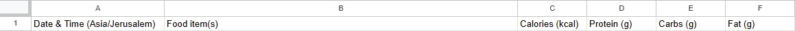
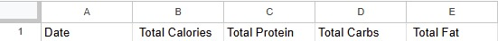

# Deployment Guide: Nutrition Tracker

This guide provides instructions to deploy the nutrition tracker application on AWS using Terraform.

## 1. Prerequisites

Before you begin, ensure you have the following:

- **AWS Account**: An active AWS account with permissions to create the required resources.
- **Telegram Bot Token**: A token for your Telegram bot, obtained from [BotFather](https://t.me/botfather).
- **Google Cloud Project**:
    - A Google Cloud project with the **Google Sheets API** and **Gemini API** enabled.
    - A **Google Service Account** with credentials (JSON file) authorized to access the Google Sheets API.
- **FoodData Central API Key**: An API key from the [U.S. Department of Agriculture's FoodData Central](https://fdc.nal.usda.gov/api-key-signup.html).
- **Personal Telegram Chat ID**: Your personal chat ID to receive daily reports. You can get this by messaging `@userinfobot` on Telegram.
- [Terraform](https://learn.hashicorp.com/tutorials/terraform/install-cli) v1.0 or later installed.
- [AWS CLI](https://docs.aws.amazon.com/cli/latest/userguide/cli-chap-install.html) installed and configured.
- A tool to create zip files (e.g., `zip` command-line utility).

## 2. Common Setup Steps

These steps are required for the deployment.

### 2.1. Create and Configure Google Sheet

The application uses a Google Sheet to store meal entries and daily summaries.

1.  **Create a New Google Sheet**:
    *   Go to [Google Sheets](https://sheets.new) and create a new blank spreadsheet.
    *   Rename it to something descriptive (e.g., "Nutrition Tracker Data").
2.  **Configure Sheets**:
    *   Rename the first sheet to `Meals`. This sheet will store individual meal entries.
    *   Set the following column headers in the first row of the `Meals` sheet:
        
    *   Create a second sheet and name it `Daily_Reports`. This sheet will store daily nutrition summaries.
    *   Set the following column headers in the first row of the `Daily_Reports` sheet:
        
3.  **Share with Service Account**:
    *   In the JSON credentials file for your Google Service Account, find the `client_email`.
    *   In your Google Sheet, click the **Share** button.
    *   Add the service account's email address and grant it **Editor** permissions.
4.  **Note the Spreadsheet ID**:
    *   The Spreadsheet ID is part of the sheet's URL: `https://docs.google.com/spreadsheets/d/YOUR_SPREADSHEET_ID/edit`.
    *   Save this ID for the next step.

### 2.2. Securely Store Secrets in AWS SSM Parameter Store

All secrets and sensitive configuration values must be stored in AWS Systems Manager (SSM) Parameter Store.

The Terraform scripts expect the parameters to be prefixed with the environment name (default is `dev`). Use the AWS CLI commands below to store your secrets.

From the project root, run the following AWS CLI commands to store your secrets. Replace the placeholder values (e.g., `YOUR_TELEGRAM_BOT_TOKEN`) and `<YOUR_REGION>` accordingly. The default environment is `dev`.

```bash
# For your Telegram Bot Token
aws ssm put-parameter --name "/dev/nutrition-tracker/telegram-bot-token" --value "YOUR_TELEGRAM_BOT_TOKEN" --type "SecureString" --region <YOUR_REGION>

# For the Telegram Webhook Secret Token 
# choose a strong string (1-256 characters. Only characters A-Z, a-z, 0-9, _ and - are allowed.)
# This token is used to verify that incoming webhook requests are genuinely from Telegram,
# preventing unauthorized access to your Lambda function.
aws ssm put-parameter --name "/dev/nutrition-tracker/telegram-secret-token" --value "YOUR_SECRET_TOKEN" --type "SecureString" --region <YOUR_REGION>

# For your Gemini API Key
aws ssm put-parameter --name "/dev/nutrition-tracker/gemini-api-key" --value "YOUR_GEMINI_API_KEY" --type "SecureString" --region <YOUR_REGION>

# For your FoodData Central API Key
aws ssm put-parameter --name "/dev/nutrition-tracker/fdc-api-key" --value "YOUR_FDC_API_KEY" --type "SecureString" --region <YOUR_REGION>

# For your Google Sheets Credentials
aws ssm put-parameter --name "/dev/nutrition-tracker/google-sheets-credentials" --value file://"<PATH_TO_JSON>" --type "SecureString" --region <YOUR_REGION>

# For your Google Spreadsheet ID
aws ssm put-parameter --name "/dev/nutrition-tracker/spreadsheet-id" --value "YOUR_SPREADSHEET_ID" --type "SecureString" --region <YOUR_REGION>

# For your personal Telegram Chat ID
aws ssm put-parameter --name "/dev/nutrition-tracker/telegram-chat-id" --value "YOUR_TELEGRAM_CHAT_ID" --type "SecureString" --region <YOUR_REGION>
```

## 3. Deployment Steps

### Step 1: Prepare Deployment Files

From the project root, run the following commands to package the Python dependencies.

```bash
pip install -r requirements.txt -t lambda_layer/python
cd lambda_layer
zip -r dependencies_layer.zip python
cd ..
```

### Step 2: Deploy Infrastructure

1.  **Navigate to the Terraform Directory**:
    ```bash
    cd terraform
    ```

2.  **Customize `terraform.tfvars` (Optional)**:
    The default configuration deploys to the `us-east-1` region with an environment name of `dev`. To change this, copy the example file and edit it.
    ```bash
    cp terraform.tfvars.example terraform.tfvars
    ```
    If you change the `env` variable, ensure your SSM parameters use the same prefix (e.g., `/staging/nutrition-tracker/...`).

3.  **Initialize and Apply**:
    ```bash
    terraform init
    terraform plan -out=tfplan
    terraform apply tfplan
    ```

### Step 3: Set the Telegram Webhook

After the deployment succeeds, Terraform will output the `api_gateway_url`. Use this URL to set your Telegram webhook.

```bash
curl -F "url=<api_gateway_url>/webhook" -F "secret_token=<YOUR_SECRET_TOKEN>" https://api.telegram.org/bot<YOUR_TELEGRAM_BOT_TOKEN>/setWebhook
```

### Step 4: Destroy Resources

To tear down all the resources created by Terraform, run:
```bash
terraform destroy
```